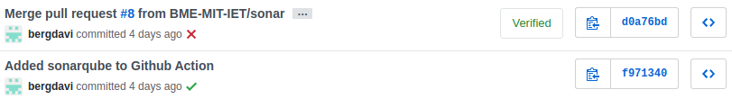

# Build keretrendszer (Gradle) frissítése
A projekt kezdetben Gradle 2.0-át használt, amit 2014-ben adtak ki. Ez a Gradle verzió egy régebbi szintaxist használt, ami azt eredményezte, hogy a legtöbb online dokumentációban leírt kód (pl. SonarQube Gradle integrálás) nem működött a projekttel.

A projekt letöltése után a Gradle Wrapper (`gradlew`) segítségével egyáltalán nem is lehetett lefordítani a kódot, mivel futtatáskor a következő hibaüzenetet adta:

```
Downloading http://services.gradle.org/distributions/gradle-2.0-all.zip

Exception in thread "main" java.io.IOException: Server returned HTTP response code: 403 for URL: http://services.gradle.org/distributions/gradle-2.0-all.zip
```

## Gradle verzió frissítése
A Gradle aktualizálásához a projektet frissítettem Gradle 6.3-ra (2020. márciusban adták ki). Ehhez a build.gradle fájlban átírtam a `gradleVersion` kulcs értékét `2.0`-ról `6.3`-ra. A build.gradle fájlon további módosításokat is végeztem, hogy a frissebb szintaktikát használja (a régi szintaktikával sikertelen volt a build).

### Wrapper
#### Régi szintaktika
```
task wrapper(type: Wrapper) {
    ...
}
```
#### Új szintaktika
```
wrapper {
    ...
}
```

### Plugin-ek
#### Régi szintaktika
```
apply plugin: "java"
apply plugin: "maven"
...
```
#### Új szintaktika
```
plugins {
  id 'java'
  id 'maven'
  ...
}
```

## Gradle Wrapper kijavítása
A projekt eredetileg a Gradle-t a `http://services.gradle.org/distributions/gradle-${gradleVersion}-all.zip` oldalról próbálta letölteni, ez minden alkalommal sikertelen volt (`HTTP 403`).

A címet módosítottam http-ről https-re, így az új cím `https://services.gradle.org/distributions/gradle-${gradleVersion}-all.zip` lett, innen már sikeres volt a Gradle letöltése.

Frissítettem a Gradle Wrapper-t a `gradle wrapper` parancs segítségével, a módosítások után a projekt hiba nélkül fordítható a `./gradlew build` parancs segítségével

# CI (Github Actions) beüzemelése
A projekthez folytonos integrációs megoldásként Github Actions-t használunk. Minden `master` branch-re nyitott Pull Request, vagy `master` branch-re való merge esetén automatikusan lefut a Gradle build, és ennek eredménye megjelenik a commit / pull request mellett.

A Github Actions által a projekten futtatott parancsok:
* `chmod +x gradlew` - futtatási jogot ad a `gradlew` fájlnak
* `./gradlew build` - futtatja a build-et

Egy sikeres és egy sikertelen build Github-on a következő képpen jelentek meg:



A sikertelen build-ekről továbbá a Github email-t is küldött a commit tulajdonosának.
