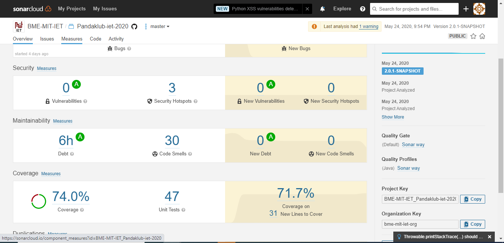

# Kód lefedettség
## Teszt kijavítása
A projekt importálásakor a `testWriteMap` teszteset bukott. Ennek az volt az oka, hogy a teszt időzóna függő volt (dátumot ír ki szövegként). Ennek javítására a tesztek futtatása előtt az időzónát beállítottuk globálisan UTC-re, valamint frissítettük a `map.nt` modellben lévő referencia dátumot. Ezekkel a módosításokkal a teszt már sikeres volt.

## Nem használt osztályok/metódusok eltávolítása
A Beans osztály getDeclaredFields metódusa, és a Fields osztály nem kellet a könyvtár megfelelő működéséhez, ugyanis az getter és setter metódusokat használ a bean-ek olvasására/módosítására. A SourcedObject és a SourcedObjectImpl interfész és megvalósítása pedig egy már nem használt, vagy még el nem készült feature részei, ami jelenleg nincs használva. Ezeket mind biztonságosan el tudtuk távolítani a projektből és ezzel nőtt a kód lefedettség.

## Eredmény
A fenti módosításokkal sikerült a kód lefedettséget 68.7%-ról 74.0%-ra növelnünk.

A projekt importálásakor:

A módosítások után:

