# Manuális tesztelés
## Tesztelési módszer
Mivel a projekt egy osztálykönyvtár a futtatásához, így a manuális teszteléshez is szükség volt egy kis alkalmazásra ami használja a tesztelendő osztályt.

Erre a célra létrehoztam a repository-n belül egy új gradle projektet a `manual-test` könyvtár alatt, amiben függőségként felvettem a tesztelendő könyvátrat.

### A teszt alkalmazás futtatása:
Először a fő projektet kell lefordítani, és telepíteni a lokális maven repository-ba a `./gradlew build install` parancsal, ezután már a teszt projekt is fordítaható a `./gradlew build` parancssal. A projekt több tesztesetet is tartalmaz. Ezek önálló package-ekben helyezkezdnek el a `main/src` könyvtár alatt (a `common` könyvtár több teszt által is használt osztályokat tartalmazza). Minden teszt package tartalmaz egy Main osztályt, az ezekben található main metódus futtatásával futtatható a teszt.

## Futtatott tesztesetek
A teszteléshez a következő lépseket végeztem el
1. Készítetttem egy egszerű ontológiát a Protege szerkesztő eszköz segítségével, majd azt elmentettem RDF/XML formátumban
1. Az ontológiához elkészítettem a megfelelő Java Bean osztályokat
1. Az ontológiát a Java alkalmazás beolvasta az elmentett xml fájlból
1. A beolvasott modellt a tesztelés alatt lévő Pinto könyvtár segítségével Java Bean-né alakította
1. Az így előállt Java objektumokon módosítást végzett
1. A módosított objektumokat ismét a Pinto könyvtár segítségével visszalakította RDF modellé
1. A modellt RDF/XML formátumban egy fájlba mentette
1. Az így létrehozott új ontológiát a Protege szerkesztő segítségével ellenőriztem

### Teszt 1
A Protege szerkesztőben készítettem egy ontológiát az alábbi adatok mintájára:

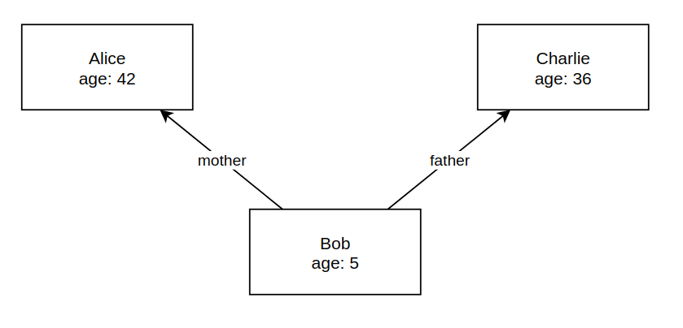

Protege-ben:

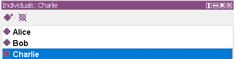
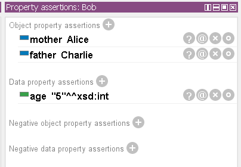

Ahhoz, hogy a Pinto könyvtár megfelelően Java Bean-ekké tudja alakítani az ontológiát fel kellett vennem a következő annotációkat:

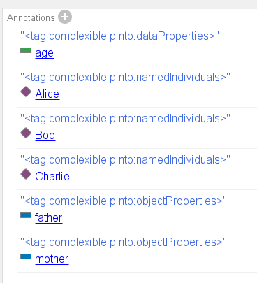
 
Ezek határozzák meg, hogy az átalakíŧás során mely értékek és referenciák mely tagváltozókba kerüljenek.
 
A `main` metódus futtatásakor a teszt sikeresen lefut. A modellhez hozzáad még egy embert Dan néven és létrejön a `modified1.xml` fájl ami a módosított ontológiát tartalmazza. A módosítások után elvárt modell:

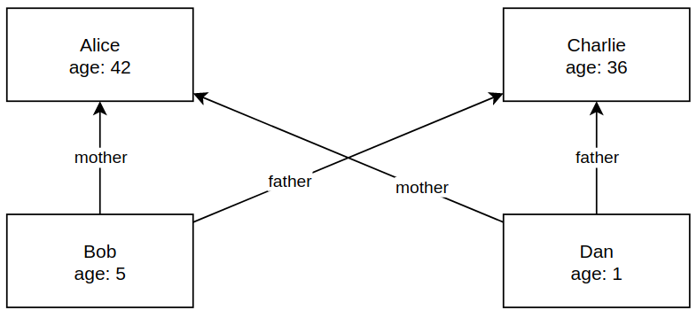

A teszt futása közben debugger segítségével figyeltem a létrehozott Java obejktumokat. Itt észre vettem egy lehetséges hibát, hogy Bob-nak a `mother` referenciája, és az emberek listáján szereplő Alice két különböző objektum:

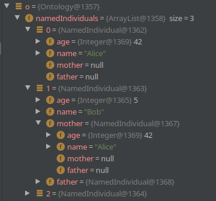

A módosított fájlt Protege-ben megnyitva ellenőriztem, hogy valóban létrejöttek a megfelelő módosítások:

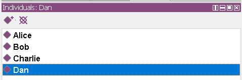
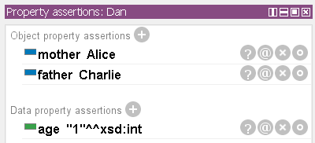

### Teszt 2
Ismét a Protege szerkesztőben készítettem egy ontológiát az alábbi adatok mintájára:

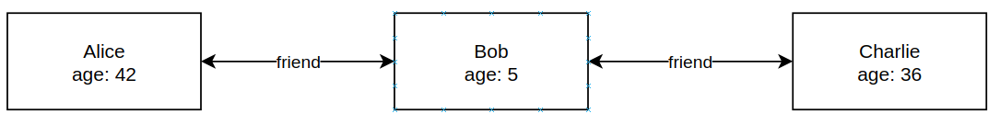

Protege-ben:

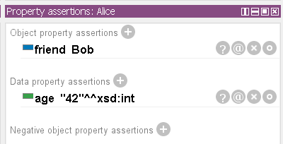
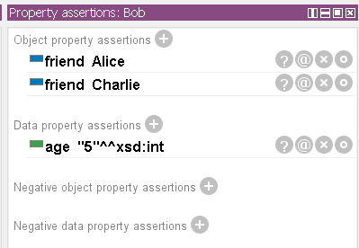

Az előző teszthez hasonlóan fel kellett vennem annotációkat:

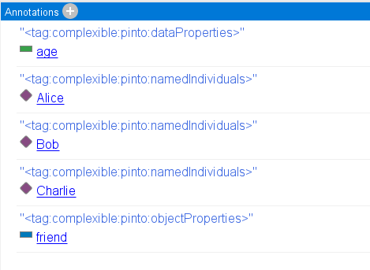

A `main` metódus futtatásakor a teszt elindult, sikeresen beolvasta az ontológiát, viszont Java Bean-re alakítás közben kilépett `StackOverflowError`-ral:

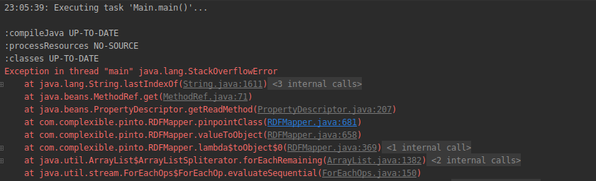

Ennek az oka nagy valószínűséggel az előző teszt során felfedezett hiba. Mivel a könyvtár átalakításkor minden referenciához egy új objektumot hoz létre a gráfban található kör miatt végtelen rekurzióba kerül, a stack betelik, és a futás leáll.

A javítás egy lehetséges módja, ha átalakításkor számontartaná az eddig létrehozott objektumokat, és ID alapján keresne köztük új objektum létrehozása előtt. 