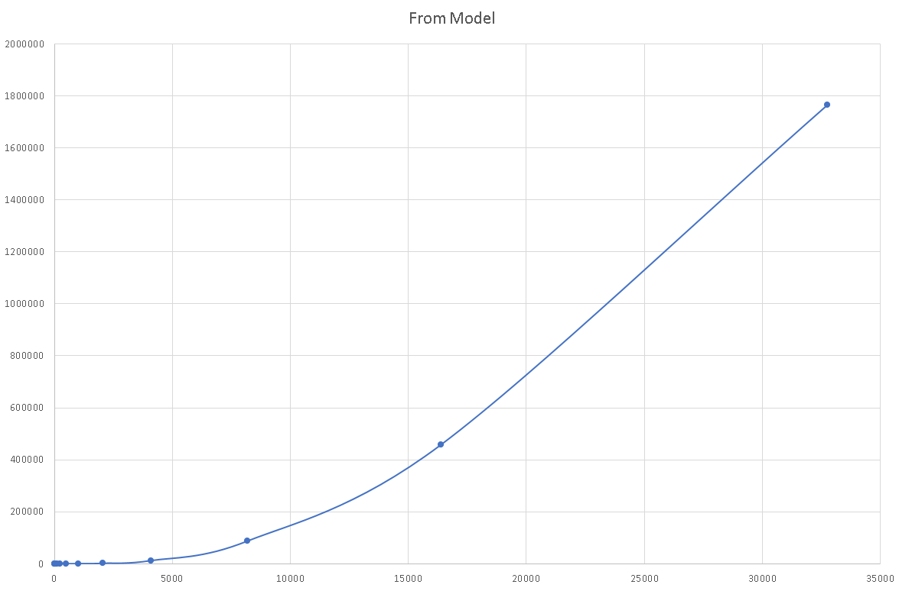

# Teljesítmény teszt
A könyvtár teljesítményét úgy vizsgáltam, hogy Java-ban létrehoztam sok objektumból álló gárfokat, majd ezeket a Pinto könyvtár segítségével először RDF modellé alakítottam, majd vissza Java objektumokká.

A tesztelést inkrementálisan végeztem. Először kis objektum struktúrákkal kezdtem, majd folyamatosan emeltem a méretüket, egészen addig amíg a teszt lefutása nem lett túl lassú (~1 óránál több).

Két féle teljesítmény tesztet végeztem, az első esetben sok pont volt a gráfban, és kevés él (minimum élszám, ha egy ponthoz nem vezet él azt a könyvtár nem tudja átalakítani, mivel nem találja meg), a második esetben pedig kevesebb pont volt, és sok él. Ezzel azt akartam letesztelni, hogy az élek átalakítása teljesítmény szempontjából hogyan viszonyul a pontok átalakításához.

A teszteket a manuális teszteknek megfelelő struktúrában hoztam létre.
## Sok pont
A teszt metalálható a `test4` package-ben.

Létrehoztam Java-ban egy teljes bináris gráfot (minden nem levél objektumnak 2 gyereke volt, az objektumok nem ismerték a szüleiket). Majd ezt a fentebb leírtaknak megfelelően RDF modellé, majd vissza Java objektummá alakítottam. Minden teszt futtatás után 1-el növeltem a gráf mélységét (így a pontok száma exponenciálisan nőtt).

### Tesztek eredménye grafikonon
A grafikonokon az X tengelyen a gráfok pontjai az Y tengelyen pedig az átalakítási idő ms-ban olvasható.

#### JAVA --> RDF

Ahogy a grafikonkról is leolvasható a konverziós idő kb. lineárisan nőtt a pontok számával.

#### RDF --> JAVA

Ebben az irányban a konverzió sokkal lassabb volt (nagy gráfok esetén), a konverziós idő exponenciálisan nőtt a pontok számával.

#### RDF <--> JAVA

Ezen a grafikonon a két előző grafikon adatai látszamak logaritmikus skálával (2-es alapú logaritmus). A grafikonról is leolvasható, hogy nagy méretű gráfok estében a JAVA --> RDF koverzió idő lineárisan nőtt (~1 a vonal meredeksége), míg az RDF --> JAVA konverzió idő exponenciálisan nőtt (~2 a vonal meredeksége).

## Sok él
A teszt metalálható a `test5` package-ben.

Java-ban a következő gráfot hoztam létre:

A létrehozott gráf 150 pont széles volt. Az élek számát a "felső" és "alsó" rétegek közötti összeköttetések számával változtattam. A legegyszerűbb esetben minden felső rétegbeli pont 1 alsó ponttal volt összekötve, míg a legkomplikáltabb esetben minden felső pont össze volt kötve minden alsóval.

### Tesztek eredménye grafikonon
A grafikonokon az X tengelyen a gráfok élei az Y tengelyen pedig az átalakítási idő ms-ban olvasható.

#### JAVA --> RDF

Ahogy a grafikonkról is leolvasható a konverziós idő kb. lineárisan nőtt az élek számával.

#### RDF --> JAVA

Ebben az irányban a konverzió sokkal lassabb volt (nagy gráfok esetén), a konverziós idő exponenciálisan nőtt az élek számával.

## Konklúzió
A futtatott tesztek alapján nem lehet megállapítani érdemi különbséget a sok pontból és sok élből álló gráfok között. Általánosan a nagyobb gráfok átalakítása több időt vesz igénybe.

A JAVA --> RDF irányú konverzió hossza lineárisan nő a gráf méretével, így akár nagy gráfok is relatív kis idő alatt átalakíthatók Java Bean-ekből RDF modellé. Ezzel szemben az RDF --> JAVA irányú konverzió hossza exponenciálisan nő a gráf méretével, így nagyobb méretű gráfok átalakítása nagyon sok időt vesz igénybe.