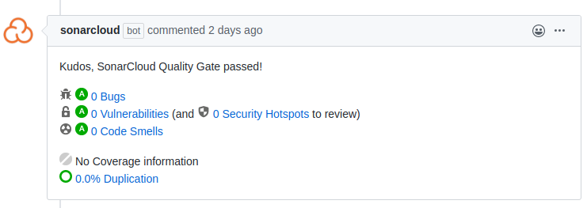

# Statikus kódanalízis
Statikus kódanalízist Sonar segítségével végeztünk. A Sonar-t a Gradle Sonar plugin segítségével futtattuk. Egy alap futtatás nem igényelt a plugin `build.gradle` fájlba felvételénél több konfigurációt.

Mivel kezdetben nem volt hozzáférésünk SonarCloud-hoz az analízist egy Docker-ben futtatott SonarQube segítségével végeztük, amit a `docker run -p 9000:9000  sonarqube:community` paranccsal lehetett futtatni.

A Sonar analízis a `./gradlew sonarqube` parancs segítségével indítható.

Miután a projektünk hozzáadásra került a tanszéki SonarCloud organizációhoz a statikus analízishez már azt használtuk a Docker-ben futtatott SonarQube helyett. Ehhez mindössze hozzá kellett adni a `build.gradle` fájlhoz a SonarCloud authentikációs adatokat a következő módon:
```
sonarqube {
  properties {
    property "sonar.projectKey", "BME-MIT-IET_Pandaklub-iet-2020"
    property "sonar.organization", "bme-mit-iet-org"
    property "sonar.host.url", "https://sonarcloud.io"
    property "sonar.login", "402465eb7804dbf420ec553db5143e0394b81794"
  }
}
```

Az analízis futtatását hozzáadtuk a Github Actions CI-hoz is, ehhez a futtatott Gradle parancshoz hozzá kellett adni a `sonarqube` task-ot, valamint környezeti változóként át kellett adni a `secrets.GITHUB_TOKEN` tokent. Ezek után minden pull request-re lefutott a SonarCloud analízis, és az eredménye megjelent a pull request mellett a következő módon:



# Kód lefedettség vizsgálata
A kód lefedettségi vizsgálatához Jacoco-t használunk, mivel ez jól integrálódik Sonar-ral, így a tesztek általi kód lefedettséget SonarCloud is megjeleníti.

Jacoco használatához hozzá kellett adni a `jacoco` plugin-t a `build.gradle` fájlhoz. Az újabb Sonar verziók már csak a Jacoco által generált XML report-ot tudják használni a lefedettség megjelenítésére (korábbi verziók tudták használni a Jacoco belsőleg használt `test.exec` fájlát is), ezért be kellett kapcsolni az XML report generálását a következő konfigurációval:

```
jacocoTestReport {
	reports {
		xml.enabled true
	}
}
```

A módosítások után a `./gradlew build jacocoTestReport sonarqube` parancsot futtatva lefutott a kód lefedettség vizsgálat, és annak eredménye megjelent SonarCloud-on. Ha a `sonarqube` task a `jacocoTestReport` task nélkül volt futtatva a SonarCloud-on megjelenő lefedettség 0 lett.
